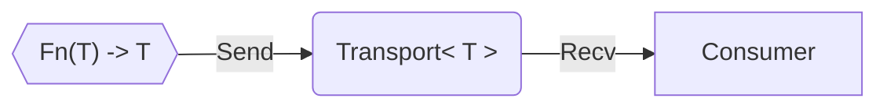
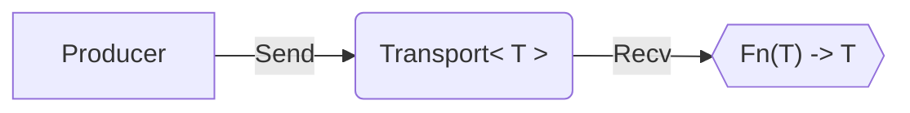
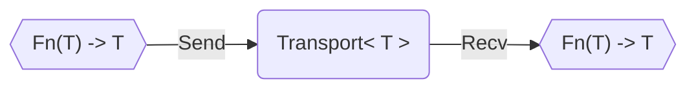
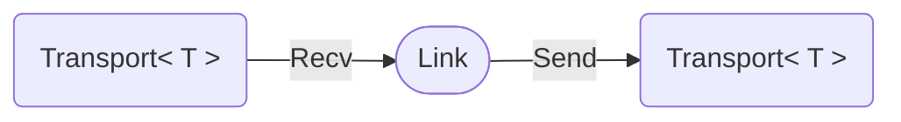
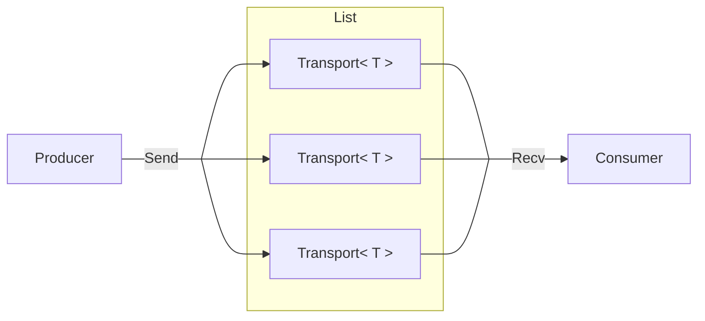
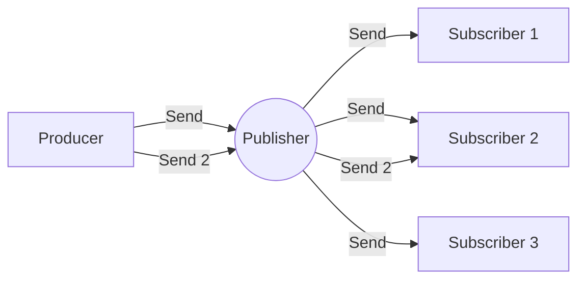
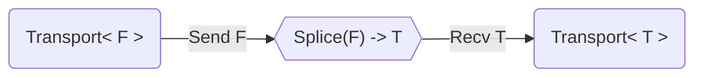
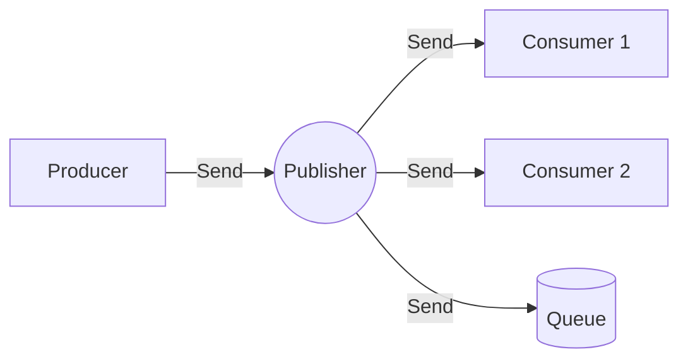

# 1. Overview
The core consists of a message system compromised of `Command`, `Event`, and `Transport<T>` types. Commonly used commands are provided along with a `Box<dyn Event>` variant, allowing `Command` extension through custom `Event` implementations.

`Transport<T>` types can be combined to create custom pipelines, allowing data to flow according to user defined logic. Additionally, custom `Transport<T>` types can be implemented to extend pipeline capabilities.

The central idea is to turn heterogenous data into homogeneous `Event` types that can all be passed through a single  `Transport<T>` instance—such as a `Transport<Command>` or `Transport<Box<dyn Event>>`.
## 1.1 Feature Flags

| Flag           | Features                                                            |
| -------------- | ------------------------------------------------------------------- |
| command        | `Command`, `event.to_cmd()`, `SerdeFormat.[de]serialize_command()`  |
| event          | `Event`, `Command::Event`, `EventMarker`, `#[event]`                |
| transport      | `Transport<T>`, all built-in `Transport<T>` types                   |
| task           | `Task<T,E,S>`, Task Utils, built-in `Transport<T>` that need `Task` |
| base           | combines `command` and `event` feature flags                        |
| transport-base | combines `transport` and `task` feature flags                       |
| serde          | `EVENT_REGISTRY`, `event.register()`, `SerdeFormat`, serialization  |
| json           | uses `serde`, `JsonSerde`                                           |
| binary         | uses `serde`, `BinarySerde`                                         |

# 2. Commands
## 2.1 Definition
Commands are simply predefined messages that can be passed through the system.

In practice, commands are defined as a variant of the `Command` enum which holds built-in commands such as `Pulse`, `Stop`, and `Restart`. A full list of built-in commands can be found in section '[2.3 Build-In Commands](#2.3%20Built-In%20Commands)' below.

To allow runtime extension within a system built on compile-time enum variants, an additional built-in `Event` command is provided that holds a `Box<dyn Event>`. The variant allows any `dyn Event` generated at runtime to be boxed and passed through the system.

This flexibility allows the system to be used by code dynamically loaded at runtime—for example, plugins with a WASM runtime—or to route `Box<dyn Event>` commands through the system without concern for the details of the underlying `Event`.
## 2.2 Indirection Layer
`Event` command variants use `Box<dyn Event>` rather than a simple reference, such as `&dyn Event`, due to trait object ownership and lifetime constraints when storing, returning from functions, transferring between threads, or using dynamic dispatch with owned data.

The `dyn Event` is only unboxed when converting back to a concrete type, meaning the `dyn Event` only needs to be boxed once—when converting it to a command variant, either manually or through the `event.to_cmd()` helper function.

Within the command system, an `Event(Box<dyn Event>)` variant is treated as any other. Its performance overhead—the single `Box` indirection layer—is incurred only when the inner `dyn Event` trait object is accessed.
## 2.3 Built-In Commands
- Event(`Box<dyn Event>`)
- Pulse
- Stop
- Restart
# 3. Events
## 3.1 Definition
The `Event` trait can be added to any type with a `'static` lifetime and the traits `Send + Sync + Any` by using the `#[event]` attribute macro.

The `#[event]` attribute macro will add the required traits by generating the derive attribute`#[derive(Clone, Default, PartialEq, Debug, Hash, EventMarker)]`. If any of the traits need to be implemented manually, they can be omitted from the generated derive by adding a comma separated list of the trait names—such as `#[event(Clone, Default)]`. Alternatively, the `EventMarker` trait macro can be manually derived alongside the required traits instead.

Any inner types used within the type implementing the `Event` trait need to also have the traits `Clone, Default, PartialEq, Debug, Hash` or be accounted for with manual implementations of those traits.

The `Event` trait acts as a wrapper exposing the required functionality of the implementing type, such as hashing or cloning, through a common interface while maintaining trait object compatibility for homogeneous collections of heterogeneous concrete types.
## 3.2 Examples
### 3.2.1 Custom Commands
The simplest events with no data—such as the types below showing a standalone struct along with an enum representing multiple events—are effectively command extensions allowing custom commands to be passed through the system as an event variant.
```Rust
#[event]
struct NewCommand;

#[event]
enum NewCommands {
   CommandOne,
   CommandTwo,
}
```
### 3.2.2 With Data
An event that holds data—such as a key press action—could potentially be modeled with a type similar to any of the following structs. Any types used within an `Event` need to implement the same traits the `Event` requires, through deriving or otherwise, as the `ActionType` and `MouseButton` enums do.
```Rust
#[derive(Clone, Default, PartialEq, Debug, Hash)]
enum ActionType {
   #[default]
   Pressed,
   Held,
   Released,
}

#[event]
struct KeyActionA(char, ActionType);

#[event]
struct KeyActionB {
   key: char,
   action: ActionType,
}

#[derive(Clone, Default, PartialEq, Debug, Hash)]
enum MouseButton {
	#[default]
	LeftClick,
	MiddleClick,
	RightCLick,
	ScrollUp,
	ScrollDown,
}

#[event]
enum UserAction {
	KeyActionA(KeyActionA),
	KeyActionC { key: char, action: ActionType },
	MouseClicked(MouseButton, ActionType),
}
```
# 4. Serialization
## 4.1 Overview
If the `serde` crate feature is enabled, both the `Command` enum and any types implementing `Event` will require the `serde::Serialize` and `serde::Deserialize` traits. The `#[event]` macro will attempt to derive them along with the other required `Event` traits.

To support concrete deserialization using `dyn Event`, even with non-self-describing formats, an event `Registry` is used. Once registered with either the `register_event!(MyEvent)` macro or calling `my_event.register()`, any `MyEvent` can be deserialized from its `dyn Event` serialization. To facilitate this, every `dyn Event` is serialized in the tuple format `(type_name, type_data)`. Then when deserializing, the `type_name` is extracted to request the corresponding logic from the `Registry`.

If the type has any generics, each generic must be explicitly declared when registering events. For example, `MyEvent<u8>`, `MyEvent<i8>` and `MyEvent<String>` all register as separate events as each generic type is deserialized differently.
## 4.2 Serialization Formats
With the `serde` feature, the `SerdeFormat` trait is also enabled with the intention of abstracting serialization formats behind a shared interface. `SerdeFormat` holds functions to Serialize and Deserialize both `Command` and `Event` types using `[u8]` byte slices.

While helpful, a `SerdeFormat` implementation isn't strictly required as the `Registry` code is contained inside the logic for `dyn Event` and will be used regardless of the serialization method.
## 4.3 Built-in Formats
`JsonSerde` and `BinarySerde` are provided behind the `json` and `binary` features respectively. `JsonSerde` generates UTF-8 strings for human readability and general use cases through `serde_json`, while `BinarySerde` can be used for faster, more compact serialization through `bitcode`.

To add custom formats, implement the `SerdeFormat` trait and add the custom format code inside each respective function.
## 4.3 Examples
### 4.3.1 Command Serde
```Rust
let cmd_bytes: [u8] = JsonSerde.serialize_commamd(&my_cmd);
let cmd: Command = JsonSerde.deserialize_command(&cmd_bytes);
```
### 4.3.2 Event Serde
```Rust
let event_bytes: [u8] = BinarySerde.serialize_event(&my_event);
let event: MyEvent = BinarySerde.deserialize_event(&event_bytes);
```
### 4.3.3 Custom Serde Format
```Rust
struct CustomSerde;

impl SerdeFormat for CustomSerde {
   fn serialize_event(&self, event: &dyn Event) -> Result<Vec<u8>, Box<dyn Error>> {}

    fn deserialize_event<T>(&self, data: &[u8]) -> Result<T, Box<dyn Error>> {}
    
    fn deserialize_event_dyn(&self, data: &[u8]) -> Result<Box<dyn Event>, Box<dyn Error>> {}
    
    fn serialize_command(&self, command: &crate::Command) -> Result<Vec<u8>, Box<dyn Error>> {}
    
    fn deserialize_command(&self, data: &[u8]) -> Result<Command, Box<dyn Error>> {}
}
```
# 5. Transports
## 5.1 Definition
The `Transport<T>` trait represents something with the ability to move a type T, as in, calling `transport.send(t)` should result in the same `t`—albeit potentially modified with the `Transport<T>` internal logic—being attainable through `transport.recv()`.

The built-in `Transport<T>` types are designed to recursively allow many `Transport<T>` types to be combined together into a single `Transport<T>` pipeline. This allows the transports comprising the internal pipeline to be abstracted behind the pipelines own outer `.send(t)` or `.recv()`. For references, look to the section '[5.3 Examples](#5.3%20Examples)' below.
## 5.2 Built-In Types
### 5.2.1 Queue
The `Queue<T>` struct implements `Transport<T>` with access to its internal `VecDeque<T>` supporting a FIFO order.

### 5.2.2 Buffered
The `Buffered<T>` struct wraps any `Transport<T>` with a `Queue<T>` in front of it, internally handling the link between the two.

### 5.2.3 Transform
The `Transform<T>` struct allows any `Fn(T) -> T` function that takes and returns the same type `T` as the `Transport<T>` passed. Custom structs can also be created to allow easier `Fn(T) -> T` reuse or more advanced features and configurations. The `NoOP` struct is provided to directly return the given `t`, allowing `Transform` stages to be skipped. 

The first `Fn(T) -> T` only activates on `transform.send(t)` while the second only activates on `transform.recv()`, allowing custom stages of any function and combination to be created.



### 5.2.4 Link
The `Link<T>` struct can be used to connect one `Transport<T>` output to another `Transport<T>` input, while the data flow is handled asynchronously though the structs internal infinite `Task`—see section '[[#6. Tasks]]' for more info.

Alternatively, an `Arc<dyn Task>` can be passed for flexibility on how the link functions. To provide a `dyn Task`, one with the signature `Task<(), TransportError, ExtendedTaskState<(), TransportError, (Arc<dyn Transport<T>>, Arc<dyn Transport<T>>)>>` must be created.

### 5.2.5 List
The `List<T>` struct is used to connect individual `Transport<T>` types in parallel. A `.send(t)` will send the data to every `Transport<T>` in the list while a `.recv()` will check each `Transport<T>` sequentially until data is returned.

### 5.2.6 Publisher
The `Publisher<T>` struct allows `Transport<T>` types to `.subscribe()` in one of two ways. Calling `.subscribe(Arc<dyn Transport<T>>)` to receive all data sent to the publisher, or calling `.subscribe((Arc<dyn Transport<T>>, String))` to subscribe to a certain `Channel`.

A `Channel` can be added with `.add_channel(String, Fn(&T) -> bool)` which uses the filter function provided to check if the data should be sent to the channels subscribers. 

### 5.2.7 Splice
The `Splice<F,T>` struct is designed to allow two `Transport<T>` of differing `T` types to be spliced together from type `F` to type `T`.  A new `Splice<F,T>` needs to be provided a `Transport<F>`, `Transport<T>`, and both a synchronous and asynchronous `Fn(F) -> Result<T, TransportError>` conversion function.

`Splice<F,T>` implements `Transport<F>`, allowing `.send(f)` but returning `TransportError` on any `.recv()`. The `splice.consumer()`, which implements `Transport<T>`, must be used for the `.recv()` calls.

To support the conversion from `F` to `T`, the `Splice<F,T>` inserts a `SpliceTransport<F>` between the provided transports that uses a `Fn(F) -> Result<(), TransportError>` to call the original `Fn(F) -> Result<T, TransportError>`, returning `Ok()` on success or the `TransportError`.

## 5.3 Examples
### 5.3.1 Point to Point

```Rust
let p2p = Queue<u8>::new();

let x = 0;
p2p.send(x).await;
let y = p2p.recv().await;

assert_eq!(x, y);
```
### 5.3.2 Transformed

```Rust
let transformed = Transform::<u8>::from(Queue::new().into(), NoOp, |x| { x+1 }).into();

let x = 1;
transformed.send(x).await;
let y = transformed.recv().await;
assert_eq!(y, x+1);

transformed.send(y).await;
let z = transformed.recv().await;
assert_eq!(z, x+2);
```
### 5.3.3 Spliced

```Rust
let splice = Splice::new(
	Queue::new().into(),
	Queue::new().into(),
	Arc::new( |x| Ok(format!("u8: {:?}", x))),
	Arc::new( |x| async move { Ok(format!("u8: {:?}", x)) }),
	).into();

let x = 2;
splice.send(x).await;
let string = splice.consumer().recv().await;
assert_eq!(string, "u8: 2");
```
### 5.3.4 Publish Subscribe

```Rust
let publisher = Publisher::new();
let consumer_1 = Consumer::new();
let consumer_2 = Consumer::new();
let queue = Queue::new();

publisher.subscribe(consumer_1);
publisher.subscribe(consumer_2);
publisher.subscribe(queue);

let x = 3;
publisher.send(x).await;

let y = consumer_1.recv().await;
let z = consumer_2.recv().await;
let w = queue.recv().await;
assert_eq!(y, 3);
assert_eq!(z, 3);
assert_eq!(w, 3);
```
# 6. Tasks
## 6.1 Definition
The `Task` struct takes user-defined state along with a mode and function to support custom logic that runs asynchronously in the background.
## 6.2 Task Config
The `TaskConfig` struct holds the `interval` that the `Task` repeats on, whether it should `stop_on_error`, the `TaskMode`, and two `Option<Arc<Fn() + Send + Sync>>` that are called on the `Task` start and completion.
```Rust
let config = TaskConfig::new(
	Duration::from_millis(100),
	false,
	TaskMode::Infinite,
	None,
	None
);
```
### 6.2.1 On Task Start
Any function passed as the configs `on_task_start` is run when the `Task` tokio thread is spawned, before the start of the `Task` loop.
### 6.2.2 On Task Complete
Any function passed as the configs `on_task_complete` is run when the `Task` naturally comes to an end, eg. without calling `.abort()` or the thread panicking. If the `Task` is cancelled or is set to stop because of an error, it will still call the function as it naturally ends.
## 6.3 Task Error
The `TaskError` enum holds the possible outcomes when a `Task` encounters an error. `TaskError` holds the `NoCondition(String)` and `Custom(String)` variants. While the `NoCondition(String)` variant is used internally, the `Custom(String)` variant allows custom error messages to be returned when setting up `Task` logic.
```Rust
let error = TaskError::Custom(String::from("Custom Error Message"));
```
## 6.4 Task State
Any type `S` with the bounds `'static + Send + Sync + Clone` is able to be passed as a `TaskState` through the use of `.as_task_state()`. The `Task` holds the state internally as `Arc<RwLock<S>>`. The inner `S` can be interacted with inside the `Task` through the functions `set_inner(s)`, `into_inner() -> &S`, and `inner_clone() -> S`. The `TaskState` also holds the number of iterations ran, the last result, and if the `Task` is currently running.
## 6.5 Task Mode
The `TaskMode` enum represents the different possible end conditions for any `Task`.
### 6.5.1 Infinite
The `TaskMode::Infinite` variant ensures a `Task` won't end unless `abort()` is called on the `Task`. 
```Rust
let mode = TaskMode::Infinite;
```
### 6.5.2 Fixed
The `TaskMode::Fixed(usize)` variant runs for as many cycles as the passed `usize`. 
```Rust
let mode = TaskMode::Fixed(10);
```
### 6.5.3 Conditional
The `TaskMode::Conditional` variant runs until the passed `Fn(task_state) -> bool` returns `True`.
```Rust
let mode = TaskMode::Conditional;
```
### 6.5.4 Duration
The `TaskMode::Duration(Duration)` variant ensures a `Task` will run for the length of the `Duration` passed.
```Rust
let mode = TaskMode::Duration(Duration::from_secs(10));
```
## 6.6 Examples
### 6.6.1 Infinite
The `Task::infinite()` call below would make a `Task` that prints the line `iteration: i` every 100 milliseconds, only stopping if `task.abort()` is called elsewhere.
```Rust
let task = Task::infinite(
	|i, _| async move {
		println!("iteration: {i}");
		Ok(())
	},
	BaseTaskState::default(),
);
```
### 6.6.2 Fixed
The `Task::fixed()` call below would make a `Task` that prints the line `element i: vec[i]` every 100 milliseconds, stopping after the 5th iteration.
```Rust
let vec = vec![1usize, 2, 3, 4, 5];

let task = Task::fixed(
	vec.len(),
	|i, state| {
		// Clone the `&Arc` reference for ownership of the resulting `Arc`, allowing the `move` for the async function without lifetime issues
		let state = state.clone();
		async move {
			// Get the ith element of the Vec stored in the `TaskState`
			let x = state.read().await.into_inner()[i];
			println!("element {i}: {x}");
			// Set the task last_result as the ith element 
			Ok::<_, ()>(x)
		}
	},
	// Pass the Vec to be used as the `TaskState`
	vec.as_task_state()
)
```
### 6.6.3 Conditional
The `Task::until_condition()` call below would make a `Task` that prints the line `false, i` every 100 milliseconds, printing `true, 5` and stopping once the state bool is set to true which causes the condition function to return true.
```Rust
let task = Task::until_condition(
	|i, state| {
		// Clone the `&Arc` reference for ownership of the resulting `Arc`, allowing the `move` for the async function without lifetime issues
		let state = state.clone();
		async move {
			let mut state = state.write().await;
			// Get the target iteration from the `TaskState`
			let iters = { state.into_inner().1 };
			if i >= iters {
				state.set_inner((true, iters));
			}
			println!("{}, {}", state.into_inner().0, i);
			// Set the task last_result as the current iteration 
			Ok::<_, ()>(i)
		}
	},
	// Pass the values to be used as the `TaskState`
	(false, 5).as_task_state(),
	// Condition checking the first element of the tuple in the `TaskState`
	|state| {
		let state = state.clone();
		async move { state.read().await.into_inner().0 }
	}
);
```
### 6.6.4 Duration
The `Task::for_duration()` call below would make a `Task` that prints the line `i, instant` every 100 milliseconds, stopping once the 5 seconds duration has passed.
```Rust
let task = Task::for_duration(
	// Set the `Task` duration for 5 seconds
	Duration::from_secs(5),
	|i, _| async move {
		let now = Instant::now();
		println!("{}, {}", i, now);
		// Set the task last_result as the current instant
		Ok::<_, ()>(now)
	},
	BaseTaskState::default()
);
```
### 6.6.5 With Config
The `Task::with_config()` call below would make a `Task` that prints the line `i+1, list[i]` for the length of the list every 100 milliseconds, printing `5, 5` and stopping once the end is reached.
```Rust
let list = vec![1usize, 2, 3, 4, 5];
let task = Task::with_config(
	|i, state| {
		let state = state.clone();
		async move {
			let x = state.read().await.into_inner()[i];
			println!((i + 1), x);
			Ok::<_, ()>(x)
		}
	},
	TaskMode::Fixed(list.len()),
	list.as_task_state(),
	Task::NO_CONDITION
);
```